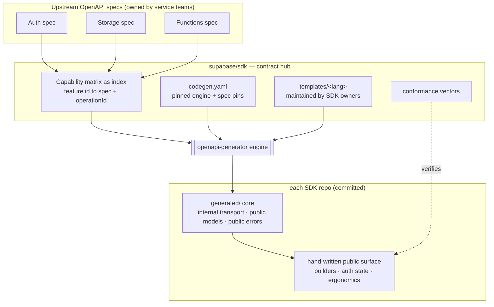

# Supabase SDK code generation — design

- Status: draft for review
- Date: 2026-06-16
- Owner: Guilherme Souza (Swift SDK owner)
- Repo: `supabase/sdk`

## 1. Problem and goal

Supabase ships seven client SDKs (`javascript`, `flutter`, `python`, `swift`, `csharp`, `go`, `kotlin`). A large fraction of every SDK is the same work re-done by hand in a different language: HTTP transport, request signing and headers, serialization, request/response models, and error-code tables. This layer drifts between SDKs, is tedious to maintain, and is exactly the kind of thing a machine should produce.

Two new hires are about to build the C# and Go SDKs from scratch. This is the moment to agree on a shared definition of code generation so each engineer spends their time on what makes their stack unique — idiomatic ergonomics — and not on plumbing that is identical everywhere.

**Goal:** generate the mechanical, drift-prone layer of each SDK from a shared contract, leaving each engineer to hand-write only the idiomatic public surface.

## 2. Goals and non-goals

**Goals**
- Generate transport, request/response models, and error types from a machine-readable contract.
- Use one generation engine across all languages, with per-language output each owner controls.
- Make some generated code (models, error types) public API, not just internal plumbing.
- Keep hand-written surfaces honest across languages with a shared conformance suite.
- Validate the whole approach on one real SDK before scaling it.

**Non-goals (for this milestone)**
- Generating the full public API surface method-for-method.
- Generating PostgREST or Realtime clients (see section 10).
- End-user code generation from a project's database schema (e.g. `supabase gen types`). This design is about SDK-internal generation, not user-facing generation.
- Building a custom generator engine.

## 3. Summary of decisions

| # | Decision | Choice |
|---|----------|--------|
| 1 | Generated/hand-written boundary | Generate transport + types + errors; hand-write ergonomics |
| 2 | Source of truth | Upstream OpenAPI specs (auth/storage/functions); this repo is the index |
| 3 | Generation engine | One shared engine (`openapi-generator`), per-language template packs |
| 4 | Template location | Central in `supabase/sdk` under `templates/<lang>/`, maintained by SDK owners |
| 5 | Consumption | Generated code committed per SDK repo; regenerated via `make generate`; CI drift guard |
| 6 | Visibility | Boundary is machine-owned vs hand-edited — some generated code is public API |
| 7 | Rollout | Swift first (owner builds the reference), then C#/Go greenfield, then the rest |
| 8 | Pilot product | Storage |
| 9 | Pilot strategy (Swift) | Parallel module beside the shipped one; conformance parity gates cutover |

## 4. Architecture: the pipeline



Reading it top to bottom: upstream specs stay the source of truth and stay owned by the service teams; this repo becomes the index that binds each feature to a spec operation and pins the generator and templates; one engine emits a per-language core that is committed into each SDK repo; the engineer hand-writes the public surface on top; a shared conformance suite verifies the surfaces behave identically.

## 5. The generated/hand-written boundary

The line is **machine-owned vs hand-edited**, not hidden vs public. The generated core is never hand-edited — it is regenerated — but parts of it are public API, re-exported as-is. Generated code splits by visibility:

- `generated/internal/` — transport, serialization, request signing. Never public.
- `generated/models/` — request/response types. **Public, re-exported as-is.** The hand-written surface returns these types; it does not define parallel hand-written DTOs.
- `generated/errors/` — error codes and types. **Public, as-is**, so error handling matches the server contract and is identical across SDKs.

The hand-written surface adds only ergonomics — builders, async patterns, auth/session state, language idioms. It stops short of re-modeling data the server already defines.

**Consequence:** making generated types public couples each SDK's public API to the upstream spec. Spec bumps therefore become release-planning events, and the drift guard must classify regeneration diffs as public (a semver event) vs internal (a patch). The upside is that no one hand-maintains types the server already defines.

## 6. Source of truth and the index

Upstream per-service OpenAPI specs are canonical for the generated layer. Auth, Storage, and Functions already publish OpenAPI specs owned by their service teams. We point at those; we do not re-describe them.

This repo becomes the **index**. Additive changes only — today's prose-only entries keep validating:

- Each `capabilities/*.yaml` feature gains an optional `binding: { spec, operationId }`.
- A new `codegen.yaml` holds the pinned `openapi-generator` version, the spec source list with version pins, and per-language template-pack refs.
- The existing TypeScript tooling in `scripts/capability-matrix/` gains a `bindings` validator and a `make generate` CLI wrapper.

The matrix's existing aggregate/parity job extends to assert that every feature an SDK declares `implemented` has a binding and is covered by generated code — so parity stops being a manual honor system.

## 7. Repo layout and ownership

The contract is central and singular; the output is per-SDK and owned.

**`supabase/sdk` — the contract hub:**

```
capabilities/*.yaml         # gains optional binding: { spec, operationId }
codegen.yaml                # NEW: pinned engine version, spec pins, template-pack refs
templates/<lang>/           # NEW: per-language template packs (CODEOWNERS -> SDK owner)
conformance/                # NEW: language-agnostic test vectors (input -> expected behavior)
scripts/capability-matrix/  # existing TS tooling, extended with bindings validator + make generate
```

Templates live centrally so packaging conventions (what is public vs internal) are reviewable in one place, but each `templates/<lang>/` directory is maintained by its SDK owner via `CODEOWNERS`.

**Each SDK repo — the owned output:**

```
Makefile -> make generate   # one command; pulls specs + config + templates from a pinned central version
.codegen-version            # pins which supabase/sdk version this SDK generates against
generated/                  # committed, machine-owned, do-not-edit core
src/ (or equivalent)        # hand-written public surface
```

**Ownership in one line:** central owns the contract and the conformance bar; each engineer owns their templates, their generated output, and their entire public surface.

## 8. Consumption: generation, committing, drift, semver

- **Committed, not built on the fly.** `generated/` lands in version control. Contributors and CI never need the generator toolchain to build or test the SDK, diffs are reviewable, and it plugs into each language's normal packaging.
- **`make generate` is the glue.** It pulls the pinned engine version, spec pins, and the `(feature -> operation)` index from a pinned version of `supabase/sdk`, runs `openapi-generator` with the SDK's central template pack, and writes `generated/`. Deterministic, because specs are version-pinned, not "latest."
- **Drift guard.** CI runs `make generate` and fails if it produces a diff. When a spec pin bumps in `codegen.yaml`, central CI opens regeneration PRs against each SDK repo.
- **Semver classification.** A regeneration diff is classified as public (a semver event — breaking or additive) vs internal (a patch). Public diffs are release-planning events reviewed by the SDK owner.

## 9. Conformance suite

A language-agnostic set of test vectors (input -> expected behavior) lives in `conformance/`. Each SDK wires the vectors into its own test suite. This keeps "idiomatic" from drifting into "incompatible," and — for any migration — doubles as the equivalence proof between an old hand-written module and a new generated-backed one.

## 10. PostgREST and Realtime (out of generated scope)

These do not fit OpenAPI and are out of scope for the generated pipeline:

- **PostgREST** is schema-dynamic — there is no fixed endpoint surface; it reflects the user's database. The client is a query/filter builder, not a set of generated operations.
- **Realtime** is a WebSocket protocol, not request/response REST.

Both keep purpose-built, hand-written cores. When addressed, they reuse the central-config and conformance patterns from this design but get their own design docs.

## 11. Pilot: Swift + Storage, parallel module

The owner builds the pilot, which lays the central rails (`codegen.yaml`, bindings, the `make generate` wrapper, the conformance harness) and the first template pack (`templates/swift/`). That pack becomes the reference the C#/Go hires mirror.

Storage is the pilot product: bounded but representative — real models, real error cases, and real transport edge cases (binary upload/download, multipart) that genuinely exercise the generated core.

Because supabase-swift is shipped, the pilot builds a **parallel Storage target** (working name `StorageGen`) beside the existing `Storage`, backed by the generated core plus a hand-written surface. The shipped module is untouched. Cutover is a later step with its own semver decision, out of pilot scope.

**Deliverables in `supabase/sdk`:**
- `binding: { spec, operationId }` added to Storage features in `capabilities/storage.yaml`
- `codegen.yaml` with the storage spec pin, pinned engine version, and a `swift` template ref
- `templates/swift/` starter pack tuned to emit public models/errors + internal transport
- `conformance/storage/` vectors
- TS tooling extended with the `bindings` validator and the `make generate` wrapper

**Deliverables in supabase-swift:**
- `make generate` produces `generated/` for storage
- A `StorageGen` target built on the generated core, exposing generated models/errors publicly
- Conformance vectors wired in and passing
- Behavior parity demonstrated between `StorageGen` and the existing `Storage`

**Success criteria:**
1. `StorageGen` is generated core + hand-written surface only — no hand-written transport, types, or error tables.
2. The conformance suite passes on `StorageGen` and matches the existing `Storage`'s behavior.
3. A simulated spec bump regenerates cleanly with a reviewable diff and a correct public-vs-internal classification.
4. A written comparison: generated-vs-hand-written ratio, ergonomics delta, and any spec gaps found — the baseline for projecting across products and a go/no-go input for cutover.

## 12. Rollout after the pilot

1. **Swift pilot** (this design) — owner builds reference + central rails.
2. **C# and Go, greenfield** — hires mirror the Swift reference, building straight on the generated core (no parallel module needed).
3. **Back-port** the generated core into the remaining existing SDKs (JS/Python/Kotlin/Flutter), product by product.
4. **PostgREST and Realtime** — purpose-built cores, their own designs.

Binding coverage expands across products (auth, functions) in parallel as each is needed.

## 13. Risks and open questions

- **`openapi-generator` Swift output quality.** Its default Swift models may not match supabase-swift's modern Codable/async conventions. Mitigation: this is exactly the template-pack work, and doing it first as the reference is the point. Validate early in the pilot.
- **Upstream spec quality.** Specs vary in completeness and accuracy across service teams. The pilot will surface gaps in the Storage spec; fixes flow upstream.
- **Public-API/spec coupling.** Addressed by the semver classification in section 8; the parallel-module pilot lets us judge generated public types before committing the real API to them.
- **Central template repo as a bottleneck.** Mitigated by `CODEOWNERS` per directory; revisit if review latency becomes a problem.
- **Open: generated-package naming/visibility conventions per language** (e.g. Swift module boundaries, Go `internal/` packages, C# `internal` access). To be fixed by the reference template pack and documented for the hires.

## 14. Glossary

- **Generated core** — the machine-owned, regenerated layer: internal transport + public models + public errors.
- **Public surface** — the hand-written, idiomatic client built on top of the core.
- **Index** — this repo's binding from a feature id to an upstream OpenAPI `(spec, operationId)`.
- **Conformance vectors** — language-agnostic input/expected-behavior cases all SDKs must satisfy.
- **Drift guard** — CI check that regeneration produces no diff against committed `generated/`.
