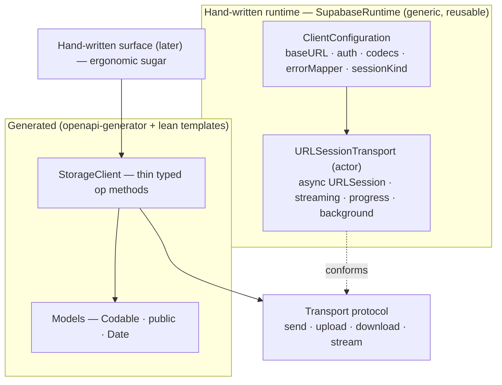

# Swift codegen: lean templates over a hand-written runtime — design

- Status: draft for review
- Date: 2026-06-16
- Owner: Guilherme Souza (Swift SDK owner)
- Repo: `supabase/sdk`
- Builds on: the Swift Storage pilot (`docs/plans/2026-06-16-codegen-swift-storage-pilot.md`) and the generated-code audit findings.

## 1. Problem and goal

The Storage pilot generates a Swift package with `openapi-generator`'s stock `swift6` templates. An audit of the output found the *data* layer (models) is fine, but the *transport* layer is not the best Swift/Apple-platform experience: file bodies are buffered fully into memory (no streaming), networking goes through a `withCheckedThrowingContinuation` bridge over `dataTask(completionHandler:)` instead of native async, a global mutable `Configuration.shared` singleton is injected into every call, concurrency uses `@unchecked Sendable` + `NSRecursiveLock`, and there is no progress reporting, no background-session support, and no streaming-response support. These are the things a hand-crafted Swift SDK does well.

**Goal:** make the generated Swift SDK modern and idiomatic for Swift 6+, with **simpler** templates, by generating only the data layer and hand-writing the transport as a small, reusable runtime.

## 2. Goals and non-goals

**Goals**
- Generate only models + a thin, typed client; hand-write the transport.
- A generic, reusable runtime usable by Storage now and Auth/Functions later.
- First-class streaming upload/download, **upload/download progress**, **background sessions**, and **streaming responses** (event streams / SSE).
- Native Swift 6 concurrency (actors, `Sendable`, async/await), injected configuration (no singleton), typed errors.
- Keep the shared engine (`openapi-generator`) and the existing pipeline (normalizer, `codegen.yaml`, binding, drift guard) driving the data layer — so Swift stays a mirrorable reference for C#/Go.

**Non-goals (this design)**
- Switching Swift to a different generator (e.g. Apple's `swift-openapi-generator`) — considered and declined to preserve the one-shared-engine pillar and Swift's role as the cross-SDK reference.
- The normalizer naming/dedup batch from the audit (operationIds, response-schema names, shared `$ref`s, `date-time`, int-not-double, HEAD/trailing-slash dedup) — it improves the *names/types* the generator emits but is independent of this work; separate effort.
- The hand-written ergonomic surface layer — a later, optional layer on top of the generated client.

## 3. Decisions

| # | Decision | Choice |
|---|----------|--------|
| 1 | Vehicle for modern Swift | Minimal templates + hand-written Swift 6 runtime (not full Mustache rewrite, not a different generator) |
| 2 | Generated ↔ runtime contract | Thin generated methods over an injected `Transport` protocol |
| 3 | Runtime reusability | Generic, reusable package (`SupabaseRuntime`); product specifics injected via config |
| 4 | Transfer capabilities | Streaming I/O + progress + background sessions + streaming responses, all in the runtime |
| 5 | Configuration | Injected `ClientConfiguration` (no global singleton); async `AuthProvider` |
| 6 | Scope | This design = the runtime package (sub-project A) + the lean template pack targeting it (sub-project B) → two implementation plans |

## 4. Architecture



Only the data layer (models + a thin `StorageClient`) is generated. The `Transport` protocol is the entire seam between machine-owned and hand-written. The hand-written `SupabaseRuntime` package carries every idiomatic, stateful, lifecycle-aware concern. The generator's ~700-line transport machinery is deleted from the template set.

## 5. The generated ↔ runtime contract

The seam is one value type plus a small protocol, all in `SupabaseRuntime`. Generated code depends on nothing else.

```swift
public enum HTTPMethod: String, Sendable { case get, post, put, delete, patch, head }

public struct HTTPRequest: Sendable {
  public var method: HTTPMethod
  public var path: String                 // percent-encoded via RequestPath interpolation
  public var query: [URLQueryItem] = []
  public var headers: [String: String] = [:]
}

public struct HTTPResponseHead: Sendable { public let status: Int; public let headers: [String: String] }
public enum UploadSource: Sendable { case file(URL); case data(Data) }

public struct TransferProgress: Sendable {
  public let completed: Int64
  public let total: Int64?          // nil when length unknown
  public var fraction: Double?      // completed/total when known
}

// Returned synchronously by upload/download; carries live progress + the awaitable result.
public struct TransferTask<Value: Sendable>: Sendable {
  public let progress: AsyncStream<TransferProgress>   // finishes when the transfer ends
  public func value() async throws -> Value            // awaits the final (decoded) result
  public func cancel()
}

// Streamed response body for event streams / SSE / incremental reads.
public struct ResponseStream: Sendable {
  public let head: HTTPResponseHead
  public let body: AsyncThrowingStream<ArraySlice<UInt8>, any Error>
}

public protocol Transport: Sendable {
  func send<R: Decodable & Sendable>(_ request: HTTPRequest) async throws -> R                                 // GET/DELETE
  func send<B: Encodable & Sendable, R: Decodable & Sendable>(_ request: HTTPRequest, body: B) async throws -> R // JSON body
  func send(_ request: HTTPRequest) async throws                                                               // no-content
  func upload<R: Decodable & Sendable>(_ request: HTTPRequest, from source: UploadSource) -> TransferTask<R>
  func download(_ request: HTTPRequest, toFile destination: URL) -> TransferTask<Void>
  func stream(_ request: HTTPRequest) async throws -> ResponseStream
}
```

Generated op methods are one-liners; the response type is inferred, so the template just picks the overload that matches the operation's content type:

```swift
public struct StorageClient: Sendable {
  let transport: any Transport
  public init(transport: any Transport) { self.transport = transport }
}

extension StorageClient {
  public func getBucket(bucketId: String) async throws -> Bucket {
    try await transport.send(HTTPRequest(method: .get, path: "/bucket/\(param: bucketId)"))
  }
  public func createBucket(_ body: CreateBucketRequest) async throws -> CreateBucketResponse {
    try await transport.send(HTTPRequest(method: .post, path: "/bucket/"), body: body)
  }
  public func uploadObject(bucketName: String, objectPath: String,
                           from source: UploadSource) -> TransferTask<UploadResponse> {
    transport.upload(HTTPRequest(method: .post, path: "/object/\(param: bucketName)/\(param: objectPath)"), from: source)
  }
}
```

- **Path params** percent-encode through a `RequestPath` string interpolation (`\(param:)`) the runtime provides, so the template emits a plain interpolated string and correctness lives in the runtime.
- **Query params** map from optional typed args to `[URLQueryItem]`, skipping `nil` — a small template loop.
- **Errors are typed.** On non-2xx the runtime runs `ClientConfiguration.errorMapper(data, head)` and throws its result (e.g. a `StorageError` decoded from `ErrorBody`); absent a mapper it throws `TransportError.http(status:data:head:)`. Callers `catch` a real error, not raw `Data`.
- **Template → transport-method mapping by content type:** JSON request/response → `send`; binary upload → `upload`; file/stream download → `download`/`stream`.

## 6. The runtime package — `SupabaseRuntime`

Generic, reusable, hand-written, in `codegen/runtime/swift/SupabaseRuntime/`. Small single-responsibility files, each unit-tested:

| File | Responsibility |
|------|----------------|
| `Transport.swift` | `Transport` protocol + `HTTPRequest`/`HTTPMethod`/`HTTPResponseHead`/`UploadSource` |
| `Streaming.swift` | `TransferProgress`, `TransferTask`, `ResponseStream` |
| `ClientConfiguration.swift` | base URL, default headers, JSON coders, `errorMapper`, `sessionKind` |
| `AuthProvider.swift` | async header supplier (`@Sendable () async throws -> [String: String]`) — fits token refresh |
| `URLSessionTransport.swift` | the `actor` implementing `Transport`: native `URLSession.data(for:)`, streaming `uploadTask(fromFile:)`/`downloadTask`, `bytes(for:)`-based `stream`, background config, cancellation |
| `SessionDelegate.swift` | `NSObject` URLSession delegate bridging callbacks → progress streams / continuations |
| `TransportError.swift` | typed errors: `http(status,data,head)`, `transport(Error)`, `decoding(Error)`, `cancelled` |
| `RequestPath.swift` | `\(param:)` percent-encoding string interpolation |
| `MockTransport.swift` | in-memory `Transport` so generated clients and the surface test with zero network |

**Concurrency model:** `URLSessionTransport` is an `actor`; progress comes from `URLSessionTaskDelegate.didSendBodyData` (upload) and `URLSessionDownloadDelegate.didWriteData` (download) feeding the `TransferTask.progress` continuation; `cancel()` bridges Swift `Task` cancellation to `URLSessionTask.cancel()`. No `@unchecked Sendable`, no manual locks.

**Background sessions:** selected via `ClientConfiguration.sessionKind = .background(identifier:)`, building the transport on `URLSessionConfiguration.background`. Two constraints are intrinsic and baked into the design:
1. Background transfers are **file-based only** (`UploadSource.file` / `download(toFile:)`); in-memory bodies are rejected for background.
2. They need an **app-relaunch hook**: the runtime exposes `handleBackgroundEvents(identifier:completionHandler:)` for the app to call from `handleEventsForBackgroundURLSession` / SwiftUI `backgroundTask`, so the transport resumes pending `value()` continuations and flushes final progress after the system relaunches the app.

**Streaming responses:** `stream(_:)` returns the response head + an `AsyncThrowingStream` of byte chunks (from `URLSession.bytes(for:)`); the hand-written surface parses domain frames (e.g. an SSE parser) on top. The transport stays content-agnostic.

**Testing:** pure types tested directly; `URLSessionTransport` tested against a stubbed protocol (a `URLProtocol` subclass) so no real network is needed; `MockTransport` lets downstream layers test without URLSession at all.

## 7. Template + `codegen.yaml` changes

- **New `templates/swift/` pack:**
  - `api.mustache` → emit a single `StorageClient` (struct, `public init(transport:)`, per-tag `extension`s) of thin op methods over `Transport`, replacing the static-func API classes.
  - `Package.mustache` → generated `Package.swift` depends on the local `SupabaseRuntime` package and `import`s it.
  - Model templates stay close to stock; light touch only if required (e.g. enforce `Sendable`).
- **Suppress the stock infrastructure** with `.openapi-generator-ignore`: `URLSessionImplementations`, `RequestBuilder`, `Configuration`, `JSONEncodingHelper`, `OpenISO8601DateFormatter`, `SynchronizedDictionary`, `OpenAPIMutex`, `APIHelper`, `CodableHelper`, `JSONDataEncoding`, `Extensions`, `APIs.swift`, `Validation` — all replaced by `SupabaseRuntime`.
- **`codegen.yaml` swift target:** add `templates: templates/swift`; set `generatorProperties.nonPublicApi: "false"` and `enumUnknownDefaultCase: "true"`; keep `projectName`. (The `library`/`responseAs` properties stop mattering once the stock transport is suppressed, but stay harmless.)

## 8. Scope, packaging, and decomposition

- **In-repo layout:** `codegen/runtime/swift/SupabaseRuntime/` (committed, `swift test`-covered) and `codegen/generated/swift-storage/` regenerated to depend on it via a local SwiftPM path. `swift build` and the existing `generate:check` drift guard both apply.
- **Two implementation plans:**
  - **Plan A — `SupabaseRuntime`:** the runtime package, hand-written and TDD, buildable and testable with zero generation. It is the foundation and stands alone.
  - **Plan B — lean templates + regenerate:** the `templates/swift` pack + `codegen.yaml` changes; regenerate Storage onto the runtime; `swift build` clean; drift-guarded.
- **Separate follow-ups (not in this spec):** the normalizer naming/dedup batch (audit), and the hand-written ergonomic surface.

## 9. Risks and open questions

- **Background-session semantics are genuinely complex** (app relaunch, persisted task→continuation mapping, file-only). The design contains them behind the `sessionKind` config + `handleBackgroundEvents` hook; the first Plan A milestone should prove a foreground transfer with progress before background is wired.
- **openapi-generator template-override mechanics** — suppressing supporting files via `.openapi-generator-ignore` while overriding `api`/`Package` templates needs validation (a short spike at the start of Plan B), since the generator still expects a `library`.
- **`send` overload resolution** — the no-body vs body vs no-content overloads must resolve unambiguously from generated call sites; verify with the real operation set.
- **`stream` for Storage** — Storage's object GET is binary; whether it maps to `download(toFile:)`, a buffered `send -> Data`, or `stream` is a per-op modeling choice the template makes by response content type; confirm during Plan B.
- **Reuse vs the existing supabase-swift networking** — when this is extracted to `supabase-swift`, `SupabaseRuntime` should reconcile with whatever shared networking exists there; out of scope in-repo, but keep the package boundary clean to ease that.

## 10. Glossary

- **Transport** — the protocol seam between generated code and the runtime (`send`/`upload`/`download`/`stream`).
- **`SupabaseRuntime`** — the generic, reusable, hand-written Swift package implementing `Transport` over URLSession.
- **`TransferTask`** — a handle for an in-flight upload/download exposing live `progress` and an awaitable `value()`.
- **`ResponseStream`** — a streamed response (head + byte chunks) for event streams / SSE.
- **Generated client** — the thin `StorageClient` of typed op methods the generator emits over `Transport`.
