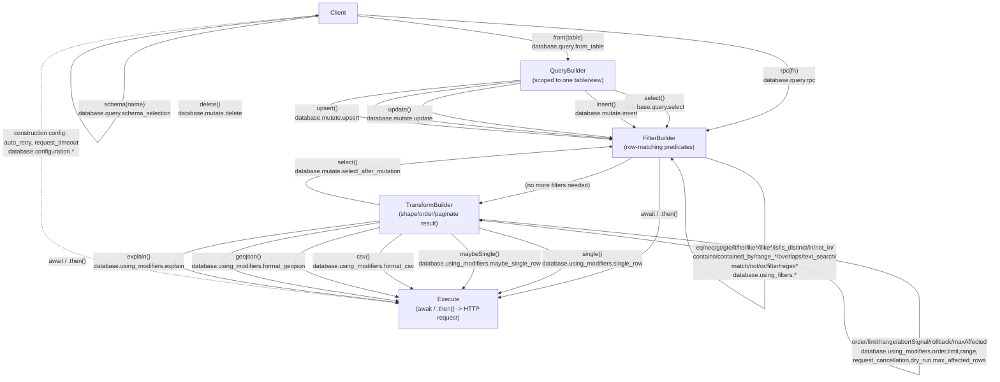

# PostgREST Query Builder — Architecture

<!-- Area-wide architecture doc, not a single-feature spec. Describes the
     builder chain shared by every database.* capability, independent of any
     one SDK's class names or generics. This is the source of truth for how
     the builder should be composed in new and existing SDK implementations. -->

## Overview

Every `database.*` capability is a step in one linear builder chain: pick a
target (table/view or RPC function), optionally narrow rows with filters,
optionally reshape/paginate the result, then execute. The chain has five
logical stages. An SDK may implement each stage as a distinct object or reuse
one object with narrowing types (the JS reference implementation does the
latter) — either is valid as long as the external chaining behavior below
holds.

Reference implementation: [supabase-js `packages/core/postgrest-js`](https://github.com/supabase/supabase-js/tree/21e410f5622c163c3e64fc1a3bb78ee3b9ec86c9/packages/core/postgrest-js)
(`PostgrestClient` → `PostgrestQueryBuilder` → `PostgrestFilterBuilder` →
`PostgrestTransformBuilder` → `PostgrestBuilder`).

## Graph

## Stages

### Client

Holds connection state: base URL, headers, `fetch` implementation, and
construction-time config (`database.configuration.auto_retry`,
`database.configuration.request_timeout`). Not itself a query — it is the
factory for the other stages via three entry points: `schema()`, `from()`,
`rpc()`.

### QueryBuilder

Scoped to one table/view. Exposes the five entry verbs
(`select`/`insert`/`update`/`upsert`/`delete` — `database.query.select`,
`database.mutate.insert`, `database.mutate.update`, `database.mutate.upsert`,
`database.mutate.delete`). Each verb picks the HTTP method and hands off to a
FilterBuilder; the verb choice does not change which filter/modifier
capabilities are available downstream. `rpc()` bypasses this stage entirely —
there is no table and no verb choice, so the Client hands off straight to a
FilterBuilder.

### FilterBuilder

Row-matching predicates (`database.using_filters.*`). Structurally uniform:
every filter appends a predicate and returns the same stage, so any number of
filters can be chained in any order. `or()` and `not()` are filters like any
other at this stage — they don't terminate or branch the chain, they just
combine/negate predicates. Once no more filtering is needed, the chain either
executes directly or continues into TransformBuilder — a filter-only query
(e.g. `select().eq(...)`) is a complete, executable chain without ever calling
a modifier.

### TransformBuilder

Reshapes, orders, or paginates the result (`database.using_modifiers.*`).
Split into two kinds of methods:

- **Self-looping** — `order`, `limit`, `range`, `abortSignal`
  (`request_cancellation`), `rollback` (`dry_run`), `maxAffected`
  (`max_affected_rows`). These return the same stage, so they compose freely
  with each other in any order.
- **Terminal-narrowing** — `single` (`single_row`), `maybeSingle`
  (`maybe_single_row`), `csv` (`format_csv`), `geojson` (`format_geojson`),
  `explain` (`explain`). These commit the response shape; no further
  filter/modifier calls are meaningful after one of these, only execution.

`select()` at this stage is distinct from QueryBuilder's `select()`: it's the
post-mutation embed (`database.mutate.select_after_mutation`), called after
`insert`/`update`/`upsert`/`delete` to return affected rows, and it hands
back to a FilterBuilder since the embedded selection can itself be filtered
by relationship modifiers.

Relationship embedding (spread/nested selects) is a syntax within the
`select()` column argument (`database.using_modifiers.relationship_embed`),
not a separate builder method — it doesn't add a node to this graph.

### Execute

Triggered by `await` or an explicit `.then()` on the chain — not by a
dedicated method call. Performs the HTTP request, applies
`auto_retry`/`request_timeout` from Client construction, and normalizes the
response. A chain can reach Execute directly from FilterBuilder (no modifiers
used) or from TransformBuilder.

## Implementation Notes

The JS reference implementation builds exactly one object per query and
narrows its exposed type at each stage (`FilterBuilder extends
TransformBuilder extends Builder`, with terminal methods doing `return this as
unknown as Builder<...>`). This is an implementation choice to get static
typing of "what's callable next" — it is not a requirement. An SDK may instead
construct a genuinely new object at each stage transition, as long as:

- filters can be chained in any order and any quantity before execution,
- modifiers can be chained in any order after filters,
- a terminal-narrowing modifier prevents further filter/modifier calls in that
  SDK's own idiomatic way (type system, runtime error, or simply undocumented),
- `rpc()` does not require a table/verb selection step first.

## Legend — Capability ID → Graph Edge

| Capability ID | Stage / Edge |
|---|---|
| `database.query.schema_selection` | Client → Client (`schema()`) |
| `database.query.from_table` | Client → QueryBuilder (`from()`) |
| `database.query.rpc` | Client → FilterBuilder (`rpc()`) |
| `database.query.select` | QueryBuilder → FilterBuilder (`select()`) |
| `database.mutate.insert` | QueryBuilder → FilterBuilder (`insert()`) |
| `database.mutate.update` | QueryBuilder → FilterBuilder (`update()`) |
| `database.mutate.upsert` | QueryBuilder → FilterBuilder (`upsert()`) |
| `database.mutate.delete` | QueryBuilder → FilterBuilder (`delete()`) |
| `database.mutate.select_after_mutation` | TransformBuilder → FilterBuilder (`select()`) |
| `database.using_filters.*` (eq, neq, gt, gte, lt, lte, like, like_all, like_any, ilike, ilike_all, ilike_any, is, is_distinct, in, not_in, contains, contained_by, range_gt, range_gte, range_lt, range_lte, range_adjacent, overlaps, text_search, match, not, or, raw, regex, regex_icase) | FilterBuilder → FilterBuilder |
| `database.using_modifiers.order` | TransformBuilder → TransformBuilder (`order()`) |
| `database.using_modifiers.limit` | TransformBuilder → TransformBuilder (`limit()`) |
| `database.using_modifiers.range` | TransformBuilder → TransformBuilder (`range()`) |
| `database.using_modifiers.request_cancellation` | TransformBuilder → TransformBuilder (`abortSignal()`) |
| `database.using_modifiers.dry_run` | TransformBuilder → TransformBuilder (`rollback()`) |
| `database.using_modifiers.max_affected_rows` | TransformBuilder → TransformBuilder (`maxAffected()`) |
| `database.using_modifiers.single_row` | TransformBuilder → Execute (`single()`) |
| `database.using_modifiers.maybe_single_row` | TransformBuilder → Execute (`maybeSingle()`) |
| `database.using_modifiers.format_csv` | TransformBuilder → Execute (`csv()`) |
| `database.using_modifiers.format_geojson` | TransformBuilder → Execute (`geojson()`) |
| `database.using_modifiers.explain` | TransformBuilder → Execute (`explain()`) |
| `database.using_modifiers.relationship_embed` | Syntax within `select()`'s column argument — no dedicated edge |
| `database.configuration.auto_retry` | Client construction → Execute (applied during HTTP request) |
| `database.configuration.request_timeout` | Client construction → Execute (applied during HTTP request) |

## Related

- [capabilities/database.yaml](../../capabilities/database.yaml) — feature registry this graph traces
